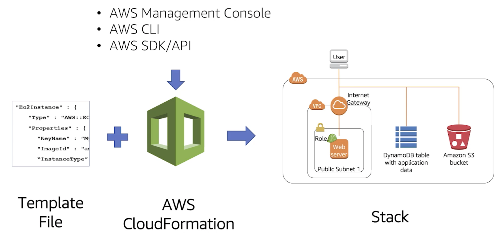

# AWS CloudFormation

AWS CloudFormation is an AWS service that provisions AWS Resources. Examples of AWS Resources are AWS Lambdas, the S3 bucket to store static files, DynamoDB tables, etc.

# Overview

