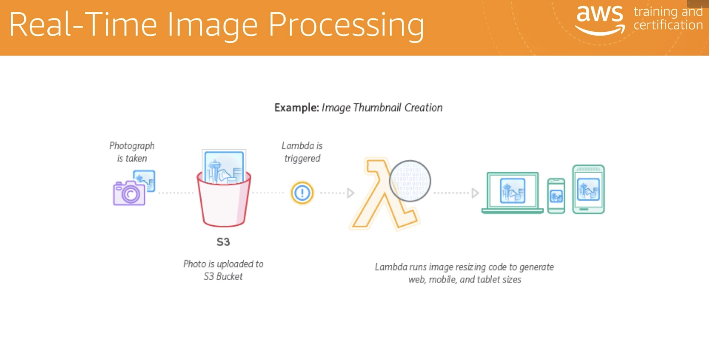
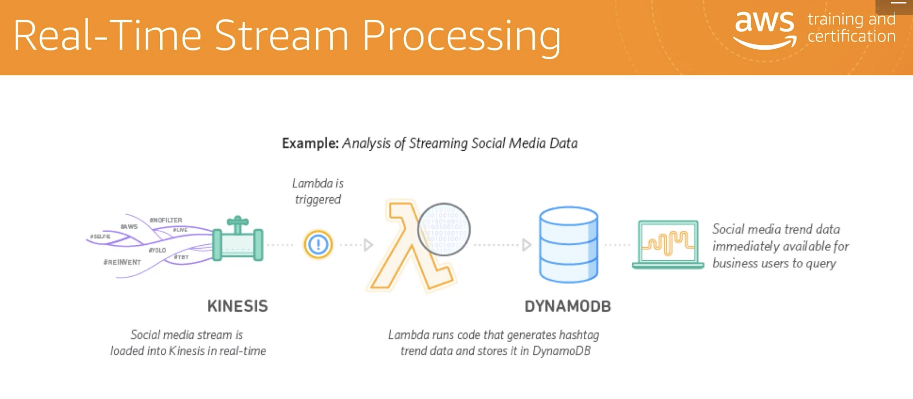
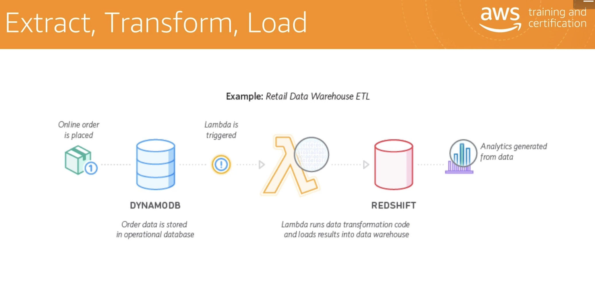
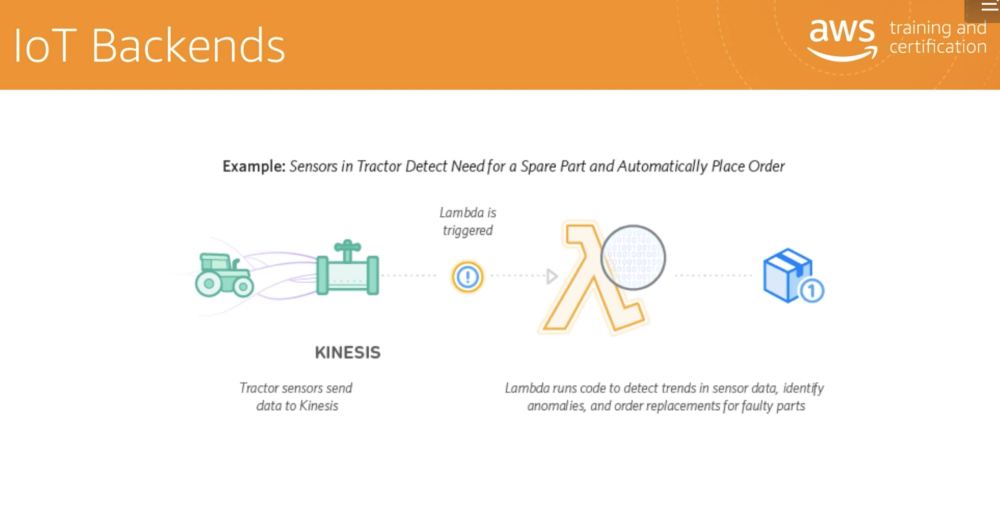
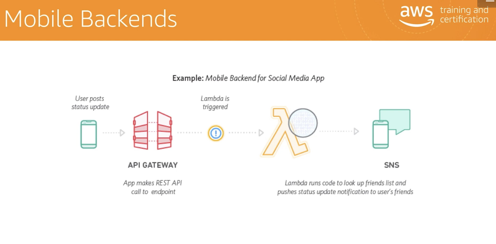
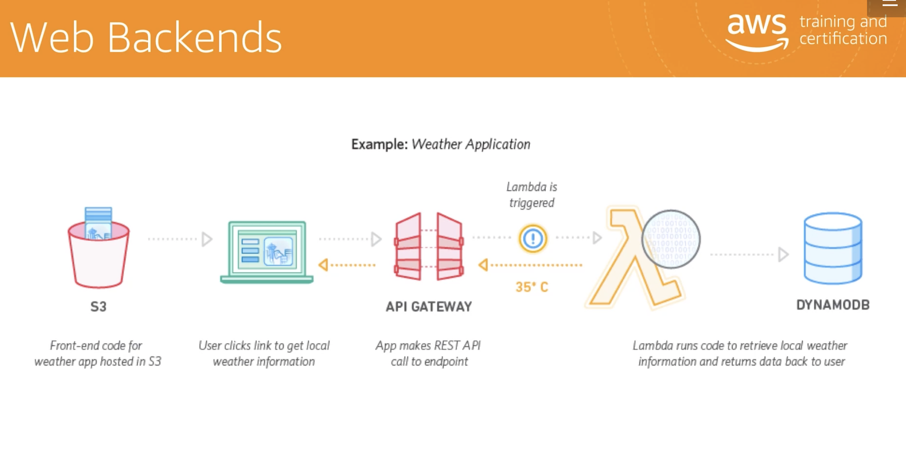

# AWS Lambda Usecases

AWS Lambda is an extension of infrastructure as code. Its usecases include automated backups, processing objects uploaded to S3, event‑driven log analysis, event‑driven transformations, Internet of Things (IoT), operating serverless websites.

**Pre-requisities**

- Create a use case
- Check if the use case is dependent on other libraries (your core language may be TypeScript/ JavaScript) eg: Do you need Angular/ React/ Nextjs
- Figure out what other AWS services/ apps you require - eg: IdaM & cognito pools, DynamoDB, Fargate, AppSync etc.
- External API access - API keys

## The image recognition app and other use cases

A customer uploads an image on S3, triggering a Lambda function to process that image immediately.

You can use this to transcode videos, thumbnails, index files, process logs, validate your content, and aggregate data in real time.

The Seattle Times, uses AWS Lambda to resize images for viewing on different devices such as desktop computers, tablets, and smartphones.

You can use AWS Lambda and Amazon Kinesis to process real‑time streaming data for application activity tracking, transaction order processing, click stream analysis, data cleansing metrics, generation log filtering, indexing social media analysis, and device data telemetry and metering.

AWS Lambdas can be used to process historical and live data stored in S3 or streamed from Amazon Kinesis. They can process 100 billion events each single month. You can use AWS Lambda to build your extract, transform, and load (ETL)pipelines.

You can also use AWS Lambda to perform data validation, filtering, sorting or other transformations for every data change in a DynamoDB table and load the transformed data to another datastore.

Zillow uses AWS Lambda and Amazon Kinesis to track a subset of mobile metrics in real time. They are able to develop and deploy a cost effective solution in just two weeks.

You can also use AWS Lambda to build your back ends for your IoT devices. You can combine API Gateway with AWS Lambda to easily build your mobile back end.

API Gateway makes it really easy for you to authenticate and process those API requests, and AWS Lambda makes it really easy for you to build and develop those rich, personalized app experiences.

Most of AWS customers use a microservices back end using AWS Lambda, SNS, and API Gateway to run both their website and their mobile applications.

You can also use AWS Lambda to build your web back ends by combining AWS Lambda and other AWS services.

Developers can build powerful web applications that automatically scale up and down. Those applications run in a highly available configuration across multiple data centers, with zero administrative effort required for scalability, backups, and multi‑data center redundancy.

