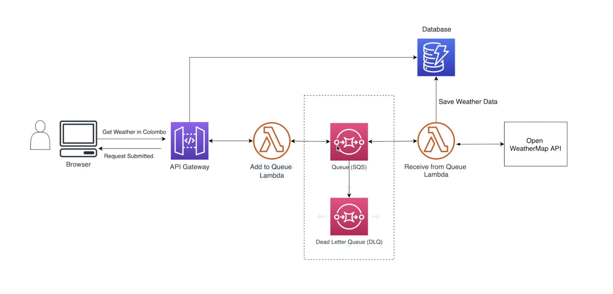

# AWS SQS

AWS Simple Queing Service, or SQS, is a fully managed message queue service that allows you to send, store and receive messages between applications without needing the applications to be online.

# Overview

Here is a diagramatic representation of how the AWS SQS works

